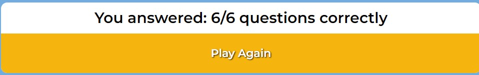

# Random Quiz PP2 

A very basic and made-in-a-rush 2nd portfolio project quiz game using JavaScript.
Made as part of my Code Institute Fullstack Web Developers course.

## Features

- __Quiz Container__ 

    - The entire quiz game is located within the quiz container.
    - This consists of a h1 title, the question content in a h2 and 4 radio buttons to select from as answers.
    

    - There is a submit button below the quiz to cycle thru the questions once answered which at the end gives the user the option to play again and shows their final score.

    

### Features Left to Implement

- This is a very basic quiz done in a rush. If more time were available the quiz answer layout would have been in 2x2 rather than the 4 in a line. In the future I will add social links in a footer below the container.

## Testing

### Validator Testing 

- __HTML__
    - No errors were found when passing through the official [NU HTML Validator](https://validator.w3.org)

- __CSS__
    - No errors were found when passing through the official [Jigsaw CSS Validator](https://jigsaw.w3.org/css-validator/validator)

- __JavaScript__
    - No errors were found when passing through the official [JavaScript Beautify Validator](https://beautifytools.com/javascript-validator.php)

### Unfixed Bugs
No unfixed bugs to deal with

## Deployment

This project was is hosted using GitHub pages. Deployment steps are as follow:

- Go to the [project repository](https://github.com/Craig-Ryan/random-quiz-pp2) and go to the Settings tab
- In the side bar on the left click on Pages and then in Build and Development click on the Source dropdown and select Main then save
- Wait about 2 minutes then reload the page and the link and option to visit to the deployed project will appear above

Go to the live link - [Random Quiz](https://craig-ryan.github.io/random-quiz-pp2/)

## Credits

### Content

- Inspiration for the JS in the quiz container specifically relating to the cycling thru the questions and incrementing score as well as the replay game option was taken from these two videos:
    - [Simple Quiz using HTML & JS - Bee Coder](https://www.youtube.com/watch?v=j9Elj5Sxfug)
    - [Build A Quiz App With JavaScript - Web Dev Simplified](https://www.youtube.com/watch?v=riDzcEQbX6k&t=724s)

### Media

- The favicon question mark icon in the browser bar was taken from [Favicon.io](https://favicon.io/emoji-favicons/question-mark)

### Acknowledgements

- Thank you to Code Institute for the course materials and the extension for this project.

